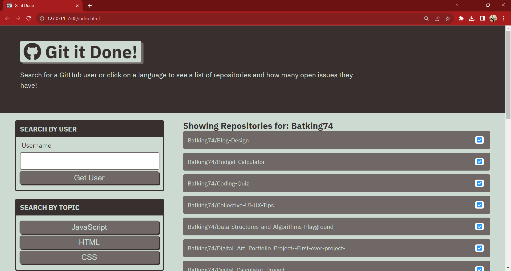

# Find Repo Issues

## Description
This project utilizes the GitHub API to streamline tracking user repositories and their issues. Effortlessly navigate your GitHub landscape, gaining quick insights and enhancing efficiency in managing and staying informed about your projects.

### Technologies Used
- HTML
- CSS
- JavaScript

Deployed Site: https://batking74.github.io/Find-Repo-Issues/

GitHub Repo: https://github.com/Batking74/Find-Repo-Issues
